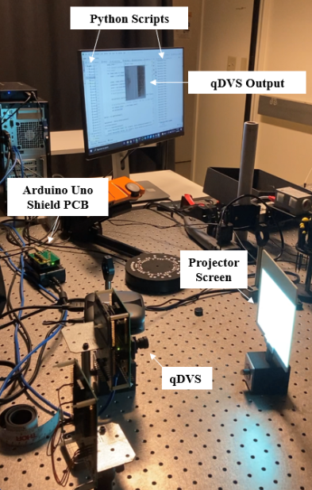
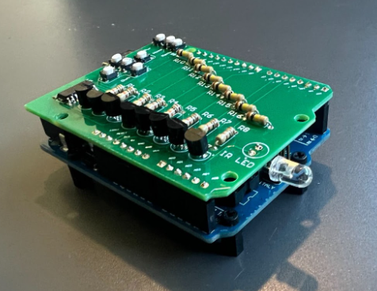

**Objective:**
The objective of performing canned experiments in the optics lab was to generate qualitative data to evaluate the performance of the qDVS in tracking eye gaze in a projected Unity video.

**Experimental Design:**

_Optics Lab Canned Experiment Set-Up_

As part of improving the set up for canned experiments in the Powell-Focht Bioengineering Hall and in an effort to increase the team’s experience in electrical design, a subproject was designed to create a remote for the projector used for the experiments. The remote PCB was a “shield” for an Arduino UNO designed to be used as a physical remote control as well as remotely through an Arduino script. To create the shield, a schematic was provided by a member of the Cauwenberghs lab in addition to a license for Altium Designer, a PCB design software. The final design for the remote shield consisted of an array of transistors, a series of buttons (for use as a physical remote), an infrared LED and a microcontroller–with the LED and microcontroller belonging to the original projector remote. Both the board schematics and physical PCB are shown below. As a control of the projector can be exerted both physically and remotely with the new device, allowing for flexibility in running the canned experiments with the qDVS.

_Assembled Arduino Uno Shield_

The projector PCB shield and corresponding code were used to turn on the projector. To perform the optical canned experiment, we first experimented with projector and screen position via a "strobe light" video found on Youtube. In doing so, we altered the position of both the projector and screen while the video was playing to determine the optimal position. Specifically we wanted the entire projector video frame to take up as much space on the projector screen as possible, and we wanted to ensure that the image was clear and in focus. We also attempted to minimize the degree of glare on the screen as we observed it could cause significant noise in the data.

For this test, we projected our Unity eye movement videos at our highest physiological speed of 72 degrees/sec. We projected videos recorded with 100%, 75%, 50%, and 25% brightness levels. An example of two output frames is shown below.

Unfortunately, due to the relatively low sensitivity of the older version of the qDVS that we had available to test, we were not able to obtain meaningful quantitative eye gaze vector results from our testing.  However, we did observe a general trend between the percentage of illumination and the ability of the qDVS to pick up clear event frames. As brightness increased, there was a higher percentage of readable event frames. Specifically, at the brightness level of 25%, 0 of the output frames contained both on and off events and resembled the circular shape of an eyeball; whereas at a brightness level of 100%, over 50% of output frames contained both types of events.

For more meaningful results, these experiments should be replicated with the newer, highly sensitive version of the qDVS which will arrive at the Cauwenberghs lab in spring of 2022.
