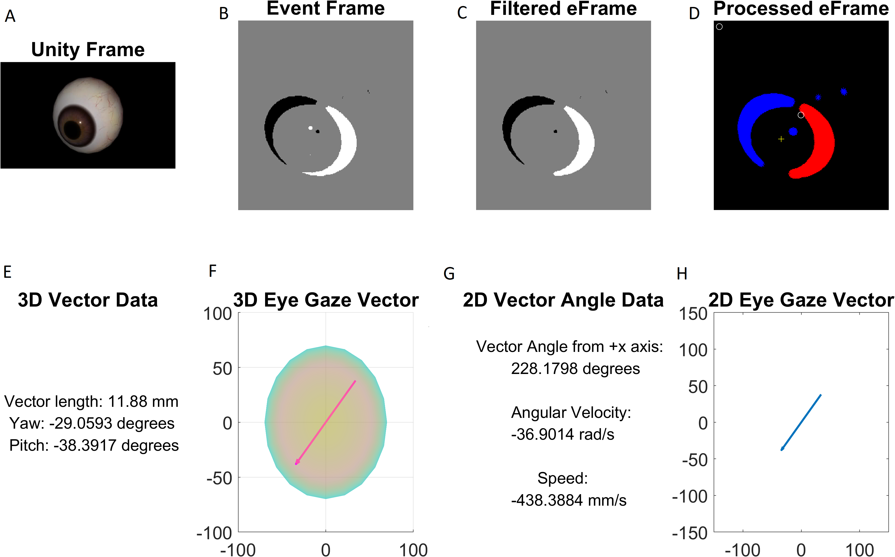

**Objective:**
The objective of creating an image processing script was to be able to obtain quantitative results from the event frames generated from the qDVS.

Open source code under: [Image Processing Github]( https://github.com/keli214/qDVS_Image_Processing)

**Experimental Design:**

In order to test the viability of the qDVS was for eye tracking, we used a qDVS simulative script; this script simulates how the actual qDVS camera generates event frames by mapping the difference from two adjacent grayscale video frames to a white pixel (ON event), black pixel (OFF event), and grey pixel (NO event). To these tests, the eye model videos created in UNITY were presented to the qDVS simulating code. 

These event frames were then presented to an image processing script in MATLAB created by Serena with help from Akshay. In order to filter any noise, each frame was filtered by eroding and dilating each cell. A weighted average between the ON and OFF events were then calculated to determine the 2-D vector; this vector corresponds to the direction in which the eye was looking. From this vector, we were able to determine the speed and the angular velocity in which the eye was moving by determining the vector's angle from the positive x-axis. For these, we used simple geometry and physics concepts while estimating the eyeball radius to be 11.88mm [1]. 

This 2D vector was then used to create a 3D eye gaze vector, again using the estimate 11.88mm eye radius; this vector was projected within a sphere. From this vector, we were able to determine the pitch and yaw angle, the angle of rotation around the x and y axis, respectively. 

The pitch and yaw angles were directly compared to the eye rotation angles from UNITY in order to determine the accuracy in using the qDVS and image processing script. The accuracy of the image processing script is shown below as well as the accuracies calculated when presenting the same videos to a eye tracking neural network (DeepVOG) and an ellipse-finding algorithm. 

| Brightness Level (%) | 25 | 50 | 75 | 100 |
| ------------- | ------------- | ------------- | ------------- | ------------- |
| qDVS Simulator  | N/A | 94.7% | 95.4% | 96.3% |
| Ellipse Fitting Algorithm  | 69.7%  | 26.1% | 47.0% | 25.7% |
| DeepVOG Neural Network | 93.5% | 94.5% | 94.3% | 94.9% |

Although the qDVS simulator and image processing script had more than 94% accuracy for 50-100% brightness levels, it could not produce any meaningful results from the UNITY video at 25% brightness; this is due to the low contract between the pupil/iris and the sclera of the eyeball. Adjusting the sensitivity of the qDVS simulator may be able to compensate for this issue. Additionally, the simulator had comparable accuracies to the neural network and outperformed the ellipse fitting algorithm. 

[1] I. Bekerman, P. Gottlieb, and M. Vaiman, "Variations in Eyeball Diameters of the Healthy Adults", Journal of Ophthalmology, vol. 2014, 2014.
