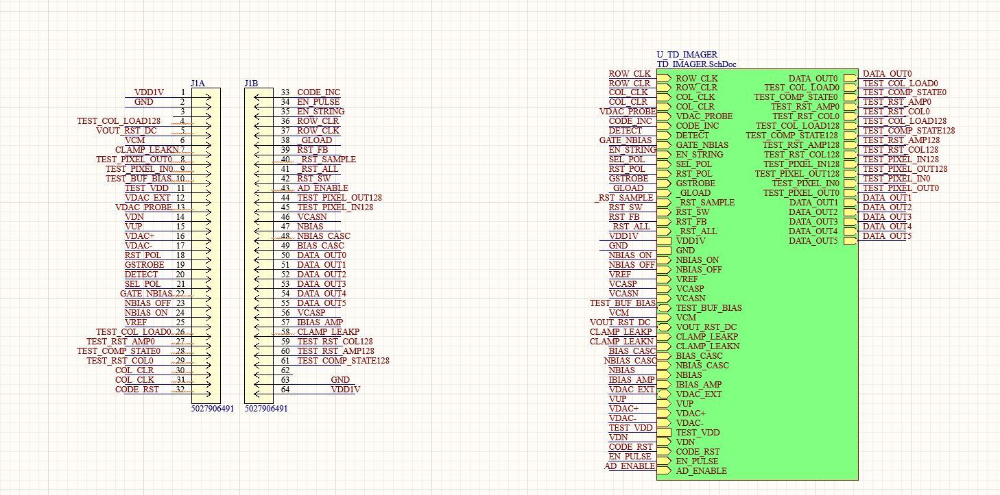
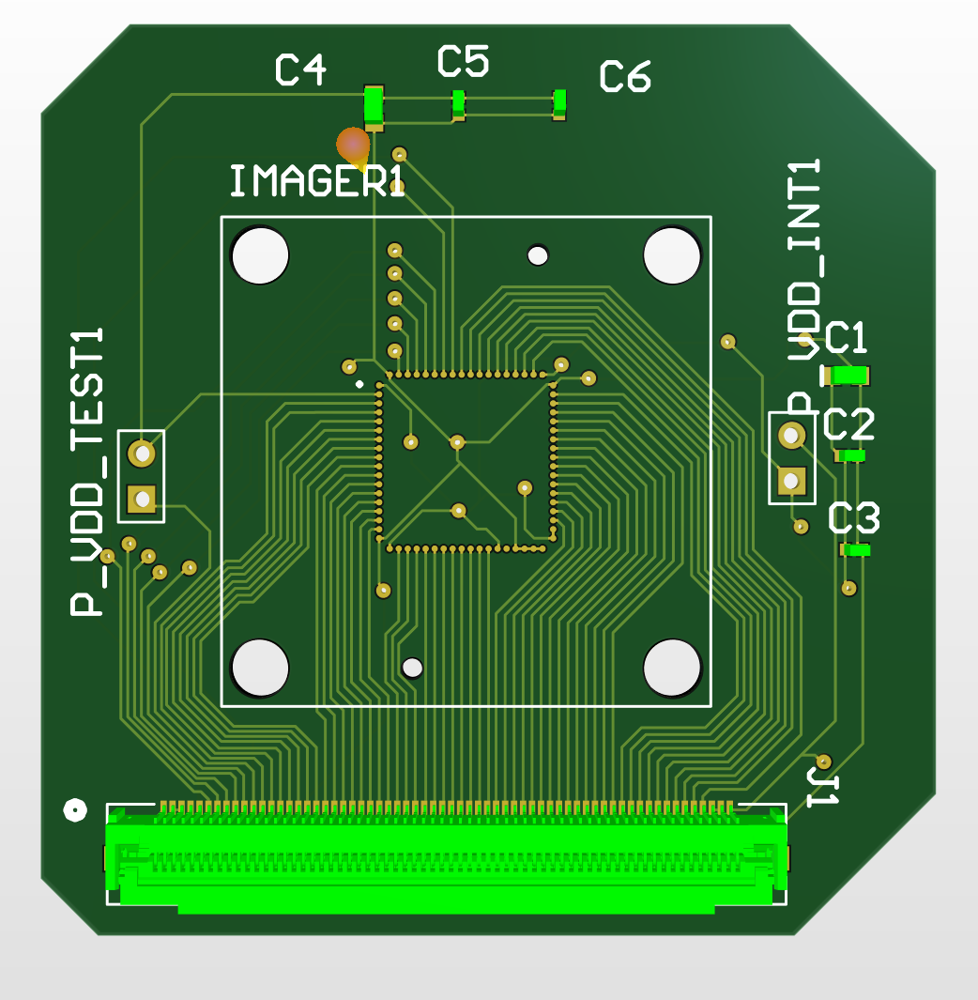

**Objective:**
The objective of redesigning the qDVS Printed Circuit Board (PCB) is to create a proof-of-concept for a implementing the qDVS on a mobile eye-tracking system on a marmoset. To be feasible, this design should be relative low in weight and size, such that the marmoset can wear it for extended periods of time without it becoming obstructive to the experiment.

**Redesign Procedure:**

_Drafting a Schematic:_

To create a proof-of-concept for the device that are viable for being placed on the on the marmosets within the Cortical and Behavioral Systems Laboratory, namely the device should be small and light enough for the 1 foot-long primates to wear on their back and their head. The current qDVS design, known as the qDVS 5, is too large and heavy for it to be supported by the body of the marmosets. If this were the case on the actual device, then the cognitive experiments on these marmosets would be incredibly impacted as their movement and behavior would be different if they were under the weight of a large device.

With assistance from the Integrated Systems Neuroengineering, a design that could meet this requirements was constructed by modifying the existing schematic to instead separate the two "stacked" boards of the qDVS 5 into a "top" and "bottom" board. The "top" board of this new design would house the socket for the imager used for capturing light from the eyes of the marmoset as well as the chip responsible for detecting the light intensity changes. The "bottom" board would contain the current "back-end" components that underly the neurmorphic design of the qDVS 5. These two boards would then be connected via a ribbon cable and two ZIF connectors on each board. Once the design was conceptualized, a schematic was created on Altium Designer, a PCB automation software, for the top board, consisting of the ZIF connector and the imager chip.

_Creating a PCB on Altium:_

After creating the schematic, the next step was to design the 3D organization of the PCB board utilizing Altium's tools. The focus of this step in the desing process was on reducing the amount of space taken up by wiring and the componets. This consideration began in the schematic phase of the PCB, by designating appropriate net and pin placements to facilitate the routing process, specifically by minimizing the need for wires to cross or the need for PCB tabs. By doing so, the size of the board would be reduced and be more viable for placement on the marmosets's head; additionally, this would prevent the PCB from exhausting the heat onto the marmoset and causing discomfort. 

With the proper pin placements set and help from the ISN in routing the PCB, we were able to reduce the size of the qDVS PCB to be used in eye-tracking. We further showed that there are even more areas for reducing the size and weight of the PCB through the separation of the boards, allowing future groups to expand on the improvments that have already been made and construct these PCB boards for qualitative quality control of the device. Further developments on the qDVS could be used to facilitate capturing event frames of the eyes through the use of the mirrors currently installed on the Cortical and Behaviroal Sysstems eye-tracking headset.

