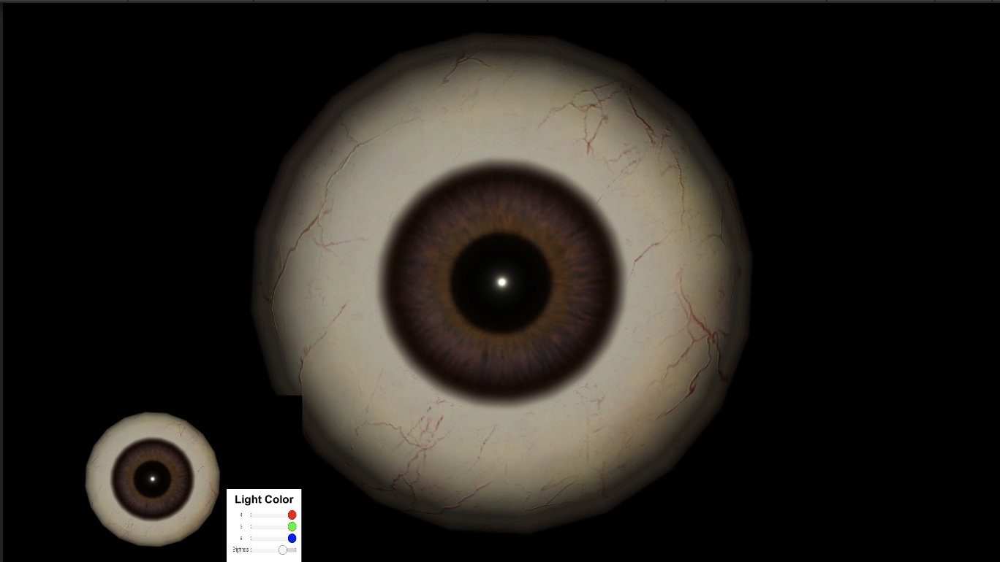

**Objective**

The performance of each eye tracking method was characterized using a generated 3D model in Unity. The Unity scene developed for this experiment included an adjustable directional light source, a realistic eye model, preset motion profiles.

Open source code and Unity Eye model under: [Unity Github](https://github.com/keli214/UNITY)

**Unity Eye Model**

A brown eye texture for the model was chosen as it is
the most common eye color among humans and non-primate
monkeys. This model is shown in above figure. Alongside the model, a UI was created to control the brightness by
equally lowering the RGB color values of the light source
to determine the effect of brightness levels on the accuracy
of the eye-tracking methods.
Furthermore, a C# script for controlling the rotation and
translation of the eye model was created to precisely control
the motion of the eye during testing. To generate random,
physiologically-relevant eye motions, the model was set to
rotate within a set range of angles along the vertical and
horizontal axes every 20 frames, with the axes of rotation
alternating every 60 frames. The Euler angle of the eye
model was outputted into a text file to serve as the ground
truth for the eye-tracking. The rotation of the eye model was
recorded under 4 different light intensities to represent dynamic illumination in real-world use. Videos were rendered
at a pixel resolution of 1280x720 and a frame rate of 60Hz.
The recording was then used as input for the 3 eye-tracking
methods: qDVS simulation, ellipse-Finding algorithm and a neural network.

**Neural Network**

The Unity eye model was also used to generate training
data for a machine learning algorithm, specifically a neural
network called DeepVOG, an open-source deep learning
framework [1]. DeepVOG consists of a fully convolu-
tional neural network (FCNN) that was reported to have
been trained using 3,946 hand-annotated video-oculography
(VOG) images to perform segmentation of the whole pupil
area. The segmentation outputs were then used to estimate
the gaze angle with an established gaze estimation algorithm. The DeepVOG NN presented a near consistent gaze vector accuracy across 4 brightness levels, ranging from 25-100\%. The inference model reported an average of 0.972 confidence value on pupil segmentation for frames shown in the following figure. However, the accuracy of DeepVOG gaze estimation is relative low compared to the qDVS simulator and the ellipse algorithm. Additionally, the neural network requires a substantial amount of computational power comparing to the qDVS simulator and requires GPU-enabled devices.

**Future Direction**

The Unity eye model can be extented to include additional eye parameters, such as pupil dilation or constriction, blinking, and motion artifacts. Additionally, this developed code may be able to be used with nonhuman Unity eye models, such as those from non-human primates or rats.

[1] Y.H. Yiu, M. Aboulatta, T. Raiser, L. Ophey, V.L. Flanagin, P.Z. Eulenburg, and S.A. Ahmadi, "DeepVOG:Open-source pupil segmentation and gaze estimation in neuroscience using deep learning," ***Journal of Neuroscience Methods***, vol. 324, 2019.

